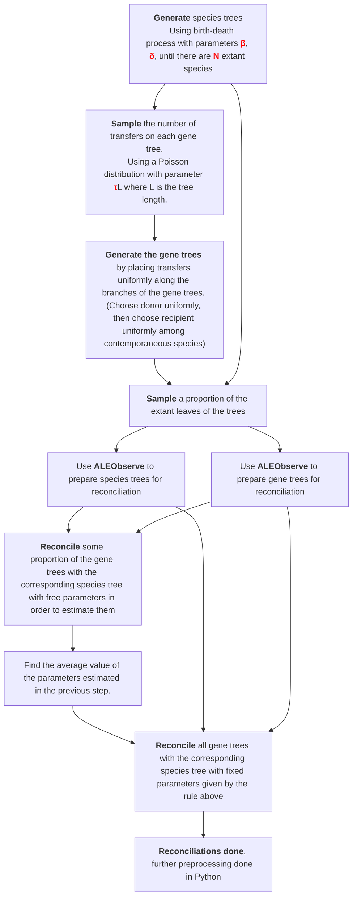

The following flowchart describes the rules in the snakefile which lead to the 

```mermaid
graph TD;
    generate_species_tree["<b>Generate</b> species trees
    Using birth-death process with parameters <font color='red'><b>&beta;</b></font>, <font color='red'><b>&delta;</b></font>", until there are <font color='red'><b>N</b></font> extant species]-->create_transfers_file["<b>Sample</b> the number of transfers on each gene tree.
    Using a Poisson distribution with parameter <font color='red'><b>&tau;</b></font>L where L is the tree length."];
    create_transfers_file-->generate_gene_tree["<b>Generate the gene trees</b> by placing transfers uniformly along the branches of the gene trees. (Choose donor uniformly, then choose recipient uniformly among contemporaneous species)"];
    generate_gene_tree-->sampling_trees["<b>Sample</b> a proportion of the extant leaves of the trees"];
    sampling_trees-->prepare_species_tree_for_reconciliation;
    sampling_trees-->prepare_gene_tree_for_reconciliation["Use <b>ALEObserve</b> to prepare gene trees for reconciliation"];
    prepare_species_tree_for_reconciliation["Use <b>ALEObserve</b> to prepare species trees for reconciliation"]-->reconcile_gene_tree["<b>Reconcile</b> some proportion of the gene trees with the corresponding species tree with free parameters in order to estimate them"];
    prepare_gene_tree_for_reconciliation-->reconcile_gene_tree;
    reconcile_gene_tree-->extract_rates["Find the average value of the parameters estimated in the previous step."];
    extract_rates-->reconcile_all_gene_trees["<b>Reconcile</b> all gene trees with the corresponding species tree with fixed parameters given by the rule above"];
    reconcile_all_gene_trees-->proof_reconciliation["<b>Reconciliations done</b>, further preprocessing done in Python"];
    generate_species_tree-->sampling_trees;
    prepare_species_tree_for_reconciliation-->reconcile_all_gene_trees;
    prepare_gene_tree_for_reconciliation-->reconcile_all_gene_trees;
```
